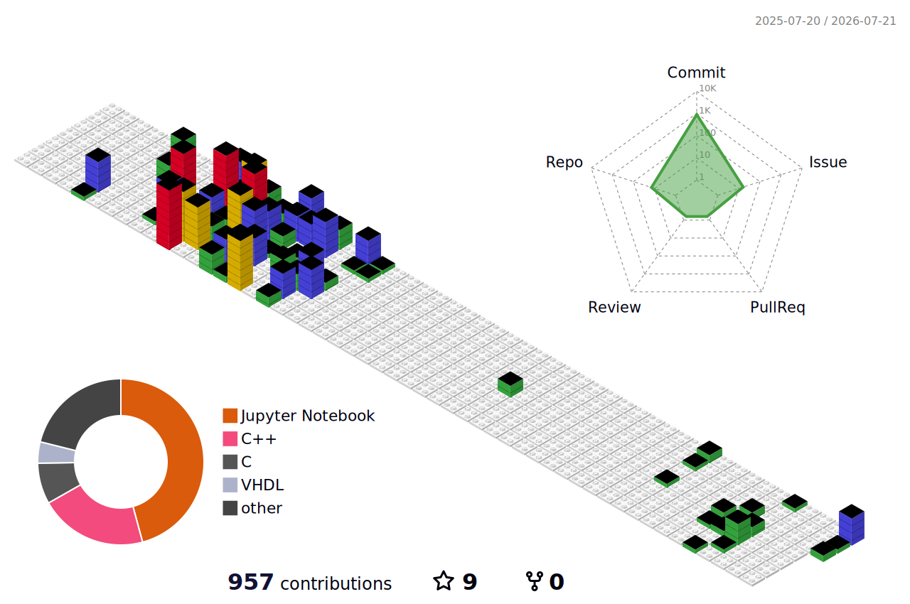

# Mohsen Safari

**Electrical Engineering** — Shahid Beheshti University of Tehran  
Embedded Systems · Computer Vision · Machine Intelligence

---

## About

Electrical Engineering student at the intersection of hardware and intelligence. I work across the full stack of embedded systems — from bare-metal firmware on ARM and AVR microcontrollers to computer vision and machine learning pipelines.

---

## Technical Interests

`Embedded Systems` `Computer Vision` `Machine Learning` `FPGA / Digital Systems` `Robotics` `TinyML`

---

## Skills

**Languages** — `C` `C++` `Python` `Verilog` `VHDL` `Assembly` `SQL`

**Embedded** — `STM32` `Arduino` `AVR` `CodeVisionAVR` `Proteus` `STM32CubeIDE` `HAL` `Bare-metal`

**ML / CV** — `NumPy` `Pandas` `Scikit-learn` `PyTorch` `TensorFlow` `OpenCV`

**Tools** — `Git` `GitHub` `Jupyter` `VS Code`

---

## Contact

- **Email:** [mohsensafari.dev@gmail.com](mailto:mohsensafari.dev@gmail.com)
- **LinkedIn:** [linkedin.com/in/mohsenn-safari](https://www.linkedin.com/in/mohsenn-safari)
- **Telegram:** [t.me/Mohsenn_sri](https://t.me/Mohsenn_sri)

---

