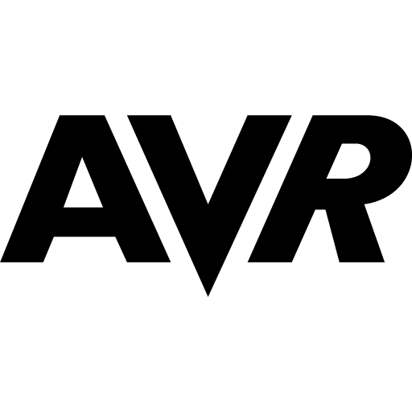

## 📌 About Me
- I'm an Electrical Engineering student passionate about building intelligent embedded systems.
- My work spans embedded firmware, digital systems, computer vision, and machine learning — combining low-level programming on ARM/AVR microcontrollers with higher-level AI-driven applications.
- Currently, I'm focusing on computer vision and deep learning, while exploring hardware acceleration techniques using FPGA for real-time processing.

## 🧠 My Focus Areas
- Embedded Systems Engineering
- Computer Vision for Embedded Platforms
- Machine Learning & Deep Learning
- Optical Communication Systems
## 🛠️ Languages & Tools

  
  
  

  
  
  
  
  
  
  
  
  
  
  
  
  
  

 

## 🔗 Connect with Me

  &nbsp;&nbsp;

  &nbsp;&nbsp;

  
      
  </a>

  

